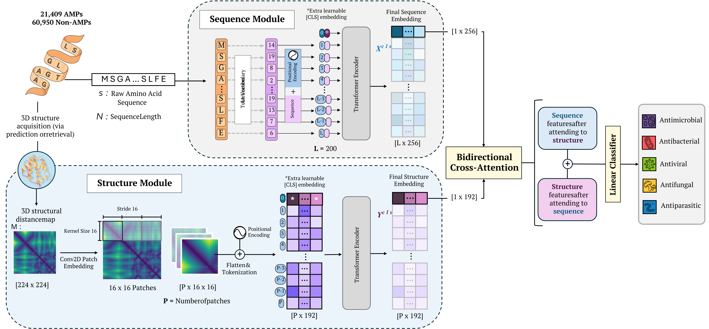

# ESCAPE: A Standardized Benchmark for Multilabel Antimicrobial Peptide Classification

<table>
    <tr>
        <td>
            Sebastian Ojeda<sup>1</sup>, Rafael Velasquez<sup>1</sup>, Nicolás Aparicio<sup>1</sup>, Juanita Puentes<sup>1</sup>, Paula Cárdenas<sup>1</sup>, Nicolás Andrade<sup>1</sup>, Gabriel González<sup>1</sup>, Sergio Rincón<sup>1</sup>, Carolina Muñoz-Camargo<sup>1</sup> and, Pablo Arbeláez<sup>1</sup>
        </td>
    </tr>
</table>
<sup>1</sup><em>Universidad de Los Andes, Colombia</em>

___________

**Expanded Standardized Collection for Antimicrobial Peptide Evaluation (ESCAPE)** is an experimental framework for multilabel antimicrobial peptide classification. It combines a large-scale curated dataset, a benchmark for evaluating models, and a transformer-based baseline that integrates both sequence and structural information.
___________
## ESCAPE Database

The **ESCAPE Dataset** integrates over 80,000 peptide sequences from 27 validated public repositories to address critical limitations in existing AMP resources, including data fragmentation, inconsistent annotations, and limited functional coverage. It distinguishes antimicrobial peptides from negative sequences and organizes their functional annotations into a biologically meaningful multilabel hierarchy, covering antibacterial, antifungal, antiviral, and antiparasitic activities.The dataset comprises 21,409 experimentally validated AMPs and 60,950 non-AMPs filtered from unrelated sources.


<p align="center">

</p>


The ESCAPE Dataset is available for download. You can access the complete ESCAPE Database on [Harvard Dataverse](https://doi.org/10.7910/DVN/C69MCD).

___________

## ESCAPE Benchmark


We evaluate six representative models for antimicrobial peptide classification: **AMPlify, AMP BERT, TransImbAMP, amPEPpy, AMPs Net,** and **PEP Net**, using the multilabel framework defined by ESCAPE. Each model was modified to support multilabel classification and trained with two fold cross validation. We report final performance by averaging predictions from both folds through an ensemble strategy. Evaluation uses two standard metrics for multilabel tasks: F1 score and mean Average Precision, which are suitable for datasets with class imbalance.

The table below summarizes the key methods for antimicrobial peptide classification of the ESCAPE Benchmark, their primary architectures, GitHub repositories, and the F1-score and mean Average Precision (mAP) these methods achieve by evaluating them on the ESCAPE Dataset.

| Method      | Primary Architecture          | GitHub Repository                                             | F1-score (%) | mAP (%) |
|-------------|-------------------------------|---------------------------------------------------------------|--------------|---------|
| Amps-Net    | GCN                           | [GitHub](https://github.com/BCV-Uniandes/AMPs-Net)            | 57.7         | 54.2    |
| TranslmbAMP | Transformer-Based                   | [GitHub](https://github.com/BiOmicsLab/TransImbAMP)           | 61.9         | 64.9    |
| AMP-BERT    | BERT                          | [GitHub](https://github.com/GIST-CSBL/AMP-BERT)               | 66.1         | 66.2    |
| amPEPpy     | Random Forest (RF)            | [GitHub](https://github.com/tlawrence3/amPEPpy)               | 65.0         | 68.0    |
| PEP-Net     | Transformer-Based                   | [GitHub](https://github.com/hjy23/PepNet)                     | 65.2         | 68.2    |
| AMPlify     | Bi-LSTM with attention layers | [GitHub](https://github.com/bcgsc/AMPlify)                    | 68.9         | 71.1    |
| **ESCAPE**  | Dual-branch transformer       | [GitHub](https://github.com/BCV-Uniandes/ESCAPE)              | **69.5**     | **72.7**|

***
### 📦 Getting Started


**1. Clone the ESCAPE repository.**
```
git clone https://github.com/BCV-Uniandes/ESCAPE.git
```

**2. Install general dependencies.** 
To set up the environment and install the necessary dependencies, run the following commands:

```
conda env create -f ESCAPE.yml
conda activate ESCAPE_env
```
***
### 🧪 Reproducing ESCAPE Benchmark Results

To reproduce the **ESCAPE Benchmark** results on the ESCAPE Dataset:

**1.**	Update the paths to both model checkpoints in the `src/ensemble.sh` executable script.

**2.**	Set the model architecture in the `test_ESCAPE.py` file.

**3.**	Run the following command:

```bash
bash src/ensemble.sh
```
This script loads both trained models, averages their outputs, and computes the final metrics over the test set.


___________

## ESCAPE Baseline

The **ESCAPE Baseline** is a dual-branch transformer architecture designed to classify antimicrobial peptides (AMPs) using both sequence and structural information. It processes amino acid sequences through a transformer encoder and structural representations through a second branch that encodes peptide distance matrices. These two modalities are fused using a bidirectional cross-attention mechanism, enabling the model to capture both biological context and spatial structure. This approach achieves state-of-the-art overall performance on the ESCAPE Benchmark, outperforming existing methods in both F1-score and mean Average Precision.

<p align="center">

</p>

### 🧬 Structural Inputs

For the structural branch, each peptide is represented as a 224×224 distance matrix, where each element corresponds to the Euclidean distance between Cα atoms in the 3D conformation. We extract these structures from [UniProt](https://www.uniprot.org/) when available, or predict them using [RosettaFold](https://github.com/RosettaCommons/RoseTTAFold) or [AlphaFold3](https://github.com/google-deepmind/alphafold3/tree/main). The resulting distance matrices are precomputed for all peptides and stored as **.npy files**.

**1. Download distance matrices.** You can download the distance matrices for the test set from this [link](https://drive.google.com/drive/folders/1e30YX0eztjauwTM5EJ00me-2JS_0iYSF?usp=sharing). 

**2. Set the distance matrix path.** Modify the path to the folder containing the distance matrices in the test.py file to ensure the model can load the correct structural inputs during evaluation.

***
### 📊 ESCAPE Baseline Evaluation

We evaluate the **ESCAPE Baseline** on the **ESCAPE Benchmark** using two standard metrics for multilabel classification: F1-score and mean Average Precision (mAP). This model achieves state-of-the-art overall performance, outperforming six existing AMP classifiers across both metrics. To reproduce the evaluation of the ESCAPE Baseline:

**1.	Download trained model checkpoints.** You can download the .pth files for both folds from this [link](https://drive.google.com/drive/folders/1e30YX0eztjauwTM5EJ00me-2JS_0iYSF?usp=sharing).


**2.	Update the script configuration.** Set the correct paths to both checkpoints in the src/ensemble.sh script, and ensure that the **MultiModalClassifier** architecture from `src/models.py` is properly initialized in `src/test_ESCAPE.py`.


**3.	Run ensemble evaluation.** Use the following command:

```bash
bash src/ensemble.sh
```

## Website License
<a rel="license" href="http://creativecommons.org/licenses/by-sa/4.0/"></a><br />This work is licensed under a <a rel="license" href="http://creativecommons.org/licenses/by-sa/4.0/">Creative Commons Attribution-ShareAlike 4.0 International License</a>.


